# Kernbau — building materials discovery

A prototype for finding, understanding and justifying a construction product by
its **declared performance**, built for the Knauf Digital take-home assignment.

Kernbau is a fictional manufacturer of insulation, reinforcement and render
systems. Every declared value in the catalogue is invented; the framework around
it — units, harmonised standards, Euroclasses, Declaration of Performance
numbers — follows what a real datasheet uses. See [Data](#data) for what that
means and what it does not.

```
docker compose up          # → http://localhost:3000
```

One command from a clean clone to a running app and a seeded database. No
accounts, no API keys, no external services.

---


## What it looks like

Captured from the running application — light theme, 1600 × 1000, no
retouching. These are the reference renderings: if a page in front of you does
not look like this, it is the browser and not the design.

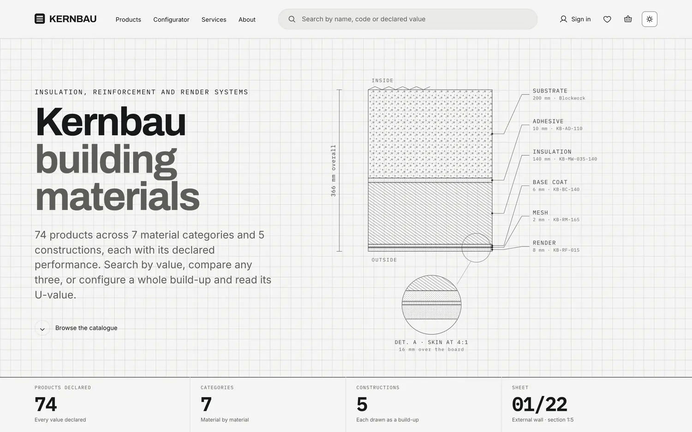

**The first screen is a sheet.** The wall this catalogue is about, cut through at scale, with the 16 mm of skin that decides the finish taken out into a detail balloon and drawn again at 4×. Every figure in the title block along the foot is queried.

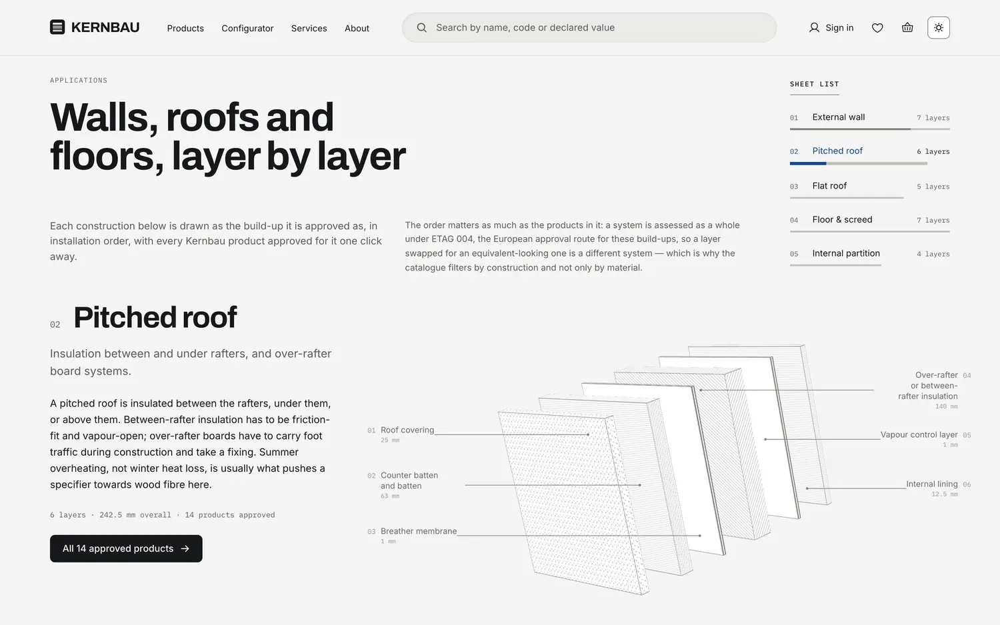

**The construction explorer.** Five build-ups as one object that comes apart as you scroll, in installation order, each layer named, hatched and measured. CSS 3D transforms — no WebGL, no animation library.

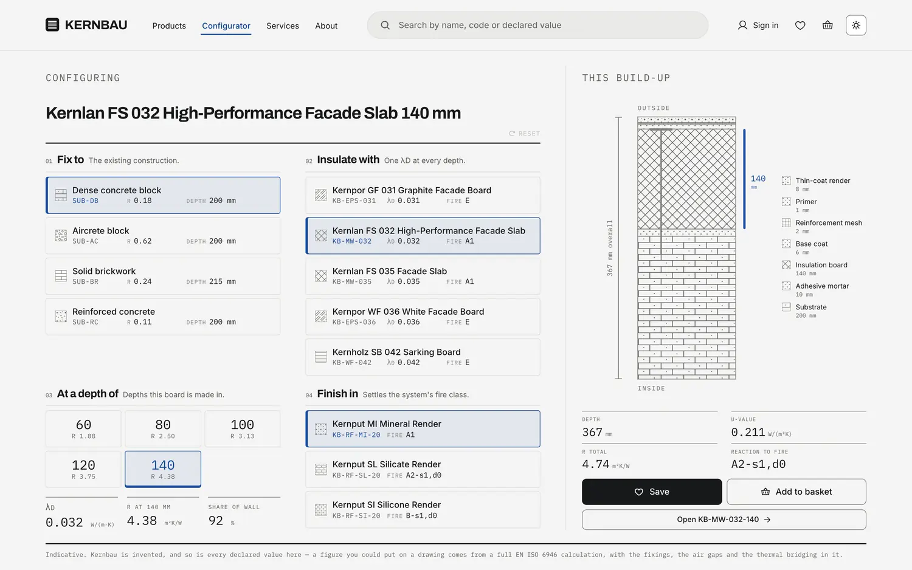

**The wall configurator.** Depth and U-value belong to the build-up, not to a board — so the build-up is what you configure. The section and its four figures stay pinned while you change the question.

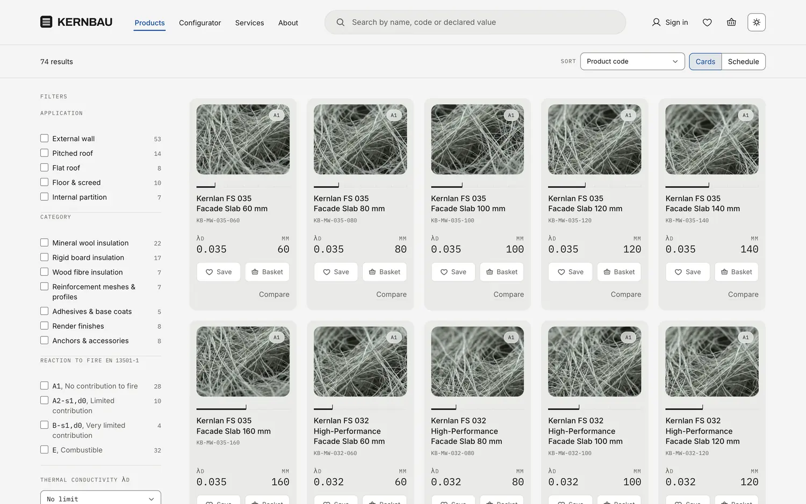

**The catalogue.** Faceted filters with counts that exclude their own dimension, all of it in the URL.

The rest of the screens sit beside the features they belong to, below.

---


## Contents

- [What it looks like](#what-it-looks-like)
- [Running it](#running-it)
- [Technology](#technology)
- [What I found out first](#what-i-found-out-first)
- [What the application does](#what-the-application-does)
- [Feature index](#feature-index)
- [Scope](#scope)
- [Architecture](#architecture)
- [The required states](#the-required-states)
- [Data](#data)
- [Design](#design)
- [Accessibility](#accessibility)
- [Performance](#performance)
- [Limitations and next steps](#limitations-and-next-steps)
- [Repository map](#repository-map)

---


## Running it


### What you need

**With Docker** — Docker Desktop, or Docker Engine 24+ with the Compose plugin.
Nothing else: Node, Postgres and every dependency are inside the images.

**Without Docker** — Node **22 or newer** (`node -v`), npm 10+, and a PostgreSQL
**14 or newer** you can reach. The one non-obvious requirement is the `pg_trgm`
extension, which ships with every standard Postgres distribution and is enabled
by `db/schema.sql` itself — search will not work without it.

No accounts, no API keys, no external services, nothing to sign up for.

---


### Path A — Docker (the intended path)

```bash
git clone git@github.com:MatLad04/knauf_application_website.git
cd knauf_application_website
docker compose up
```

That is the whole of it. What happens, in order:

1. `db` starts — `postgres:17-alpine`, with a named volume so the data
  survives a restart, and a `pg_isready` healthcheck.
2. `app` builds from the `Dockerfile` — `npm ci`, then `next build`. The
  first build takes a minute or two; every one after that is cached.
3. `app` **waits for** `db` **to report healthy** — `depends_on` with
  `condition: service_healthy`. Without that wait the first start races
   Postgres's own initialisation and the seed fails on a cold volume.
4. `docker/entrypoint.sh` **rebuilds the schema and loads the catalogue**
  (`npx tsx db/seed.ts`), then starts the server.

You are ready when the log says:

```
[kernbau] seeding database
[kernbau] starting server on port 3000
```

Open **[http://localhost:3000](http://localhost:3000)**.

Run it detached with `docker compose up -d`, and follow the log with
`docker compose logs -f app`.

---


### Path B — without Docker

Use this if you want hot reload, or if you would rather not build an image.

```bash
git clone git@github.com:MatLad04/knauf_application_website.git
cd knauf_application_website

docker compose up -d db      # just the database — or point at your own, below
cp .env.example .env         # DATABASE_URL, already pointing at port 55432

npm install
npm run db:setup             # creates the schema and loads all 74 products
npm run dev                  # → http://localhost:3000
```

`npm run db:setup` reads `DATABASE_URL` from `.env` (or `.env.local`, or the
environment, which wins over both) and prints what it loaded. It is safe to
re-run at any time: it drops and rebuilds, which is the point — see
[Schema](#schema).

**Using your own Postgres instead.** Create an empty database and put its URL in
`.env`:

```bash
createdb kernbau
echo 'DATABASE_URL=postgres://you@localhost:5432/kernbau' > .env
npm run db:setup && npm run dev
```

The seed creates everything it needs, `pg_trgm` included. The role you connect
as needs `CREATE EXTENSION` rights, which a local superuser has by default.

---


### Ports and environment


| What                | Where                          | Change it with                            |
| ------------------- | ------------------------------ | ----------------------------------------- |
| App                 | `http://localhost:3000`        | `APP_PORT=3001 docker compose up`         |
| Postgres, from host | `localhost:55432`              | the `ports:` line in `docker-compose.yml` |
| Postgres, from app  | `db:5432` (inside the network) | —                                         |


Postgres is published on **55432**, not 5432, precisely so it cannot collide
with a Postgres you already run.

There are exactly two environment variables, and both have a working value
without you setting anything:


| Variable       | Where it comes from                                                                                                                                    | Used by              |
| -------------- | ------------------------------------------------------------------------------------------------------------------------------------------------------ | -------------------- |
| `DATABASE_URL` | Compose sets it to `db:5432` inside the network. On the host, `.env` (from `.env.example`) points at `localhost:55432`. Falling back, `localhost:5432` | the app and the seed |
| `APP_PORT`     | `3000`                                                                                                                                                 | Docker Compose only  |


An explicit value in the environment always wins over `.env`, which is what
keeps the container and the host from disagreeing.

The credentials in `docker-compose.yml` are deliberately plain and local-only.
There is nothing to protect here: the data is fictional and the database is not
reachable from outside the machine.

---


### Checking it came up

Once the site loads, these five URLs exercise everything worth checking:


| URL                                                                                                                                                             | What it should show                                                   |
| --------------------------------------------------------------------------------------------------------------------------------------------------------------- | --------------------------------------------------------------------- |
| `[/](http://localhost:3000/)`                                                                                                                                   | The drafting-sheet hero, then the construction explorer as you scroll |
| `[/products](http://localhost:3000/products)`                                                                                                                   | 74 products, with counts on every filter                              |
| `[/products?q=mineralwol&lambda_max=0.035](http://localhost:3000/products?q=mineralwol&lambda_max=0.035)`                                                       | Typo-tolerant search combined with a declared-value filter            |
| `[/products?category=mineral-wool&lambda_max=0.032&thickness_min=160](http://localhost:3000/products?category=mineral-wool&lambda_max=0.032&thickness_min=160)` | The empty state, naming the one change that would end it              |
| `[/configurator](http://localhost:3000/configurator)`                                                                                                           | A wall you can build, with the U-value following your choices         |


---


### If something goes wrong


| Symptom                                                                   | Cause and fix                                                                                                                              |
| ------------------------------------------------------------------------- | ------------------------------------------------------------------------------------------------------------------------------------------ |
| `Bind for 0.0.0.0:3000 failed: port is already allocated`                 | Something else holds port 3000. `APP_PORT=3001 docker compose up`                                                                          |
| The page says **"This page could not be rendered"**                       | The database is not reachable. `docker compose ps` — `db` should be `healthy`. If you are not using Docker, check `DATABASE_URL` in `.env` |
| `[kernbau] no database at 127.0.0.1:55432 (ECONNREFUSED)` in the terminal | `docker compose up -d db`                                                                                                                  |
| The catalogue is empty, or a page 500s on a fresh clone                   | The seed did not run. `npm run db:setup`, or `docker compose down -v && docker compose up` to rebuild the volume from scratch              |
| Search returns nothing for an exact product name                          | `pg_trgm` is missing. Re-run `npm run db:setup` as a role that may `CREATE EXTENSION`                                                      |
| Edits do not appear                                                       | `docker compose` serves a production build with no source mount. Use Path B for hot reload                                                 |


Start again from nothing at any point:

```bash
docker compose down -v      # -v also drops the database volume
docker compose up --build
```

---


### Every command in the repository


| Command                      | What it does                                                    |
| ---------------------------- | --------------------------------------------------------------- |
| `npm run dev`                | Next dev server with hot reload                                 |
| `npm run build`              | Production build                                                |
| `npm start`                  | Serves a build made by `npm run build`                          |
| `npm run db:setup`           | Drops, recreates and reseeds the database (`db/seed.ts`)        |
| `npm run catalogue:generate` | Rebuilds `data/catalogue.json` from the family definitions      |
| `npm run media:optimise`     | Re-encodes `imgs/json/*` into `public/media/` — 7.6 MB → 0.7 MB |
| `npm run typecheck`          | `tsc --noEmit`                                                  |
| `npm run format`             | Prettier over the repository                                    |


---


## Technology


### The stack


| Layer      | Choice                                              | Why this one                                                                                                                                       |
| ---------- | --------------------------------------------------- | -------------------------------------------------------------------------------------------------------------------------------------------------- |
| Runtime    | **Node.js 22**                                      | Current LTS; pinned in `engines` and in the `Dockerfile`                                                                                           |
| Framework  | **Next.js 16**, App Router, React Server Components | Product pages must stand alone and be server-rendered: much of the traffic to a page like this arrives from a search engine, not from the homepage |
| UI library | **React 19**                                        | Server Components, and `useSyncExternalStore` for the two browser-held lists                                                                       |
| Language   | **TypeScript 5.9**                                  | The declared characteristics are nullable in the schema and nullable in the types; `strict` is what keeps those two facts the same fact            |
| Database   | **PostgreSQL 17**                                   | The interesting part of this problem is a dynamic `WHERE` with honest facet counts. That is a database problem                                     |
| Search     | `pg_trgm`, GIN trigram index                        | Typo tolerance without a search service. `word_similarity` at an explicit 0.45 threshold, alongside `ILIKE` for codes and substrings               |
| Driver     | `pg`, hand-written SQL, **no ORM**                  | The queries are the design. An ORM would have hidden the one part worth showing                                                                    |
| Styling    | **Tailwind CSS v4**                                 | Every colour, radius and rule is a custom property defined per theme, so the theme toggle is a data attribute rather than a second stylesheet      |
| Icons      | **Phosphor Icons**                                  | One consistent hairline set, imported per icon; the server-side entry point where the icon is not interactive                                      |
| Images     | `sharp`, `next/image`                               | Build-time re-encode plus per-layout AVIF/WebP derivatives                                                                                         |
| State      | **The URL**, and `localStorage` for the two lists   | No state library. Filters belong in an address; a shortlist belongs in the browser that made it                                                    |
| Motion     | **CSS**, plus one `requestAnimationFrame` loop      | No animation library. The construction explorer is the one thing CSS cannot do, and it is ~90 lines of spring rather than a dependency             |
| Packaging  | **Docker Compose**, app + db                        | One command, no setup instructions                                                                                                                 |
| Formatting | **Prettier**                                        |                                                                                                                                                    |


### Every runtime dependency

There are six, and each earns its place:

```
next        the framework
react       ·
react-dom   ·
pg          the Postgres driver — the only data-layer dependency
sharp       image re-encoding
@phosphor-icons/react   the icon set
```

Dev-only: `typescript`, `tailwindcss` + `@tailwindcss/postcss`, `prettier`,
`tsx` (to run `db/seed.ts` directly), and the `@types/*` packages.

### What is deliberately not here


| Not used                | Instead                                                                                      |
| ----------------------- | -------------------------------------------------------------------------------------------- |
| An ORM                  | Hand-written SQL in one file, `lib/catalogue.ts`                                             |
| A state manager         | The query string, parsed by `lib/params.ts`, plus `useSyncExternalStore` over `localStorage` |
| A data-fetching library | One server action, `browse()`, with request numbering to drop stale answers                  |
| An animation library    | CSS timelines, and one shared frame loop in `lib/motion-loop.ts`                             |
| A component library     | The components in `components/`, on the tokens in `app/globals.css`                          |
| A 3D engine             | CSS 3D transforms — the explorer is `perspective` plus `translate3d`, not WebGL              |
| An icon font            | Inline SVG in `currentColor`, so every drawing inverts with the theme                        |


The point of the list is not minimalism for its own sake. Each of those would
have been a reasonable choice on a larger team and a longer timeline; on a
prototype whose whole argument is *the queries and the URL contract are the
design*, a dependency that hides either one costs more than it saves.

## What I found out first

The full reasoning log is in `[notes.md](./notes.md)`. The three findings that
shaped the application:

**The regulatory layer is the buying argument.** Construction products sold in
the EU carry CE marking and a Declaration of Performance stating their
performance against essential characteristics — thermal conductivity, reaction
to fire, compressive strength, vapour resistance. Those declared values are what
a professional compares, because they are the values that have to be justified
later. A product page that leads with photography and buries the numbers is
answering the wrong question.

**The person who chooses is not the person who buys.** An architect specifies,
a contractor purchases, a distributor supplies, the owner pays. So the job of
this application is to help someone *choose and justify* a product — not to sell
one. That decision is why there is no price anywhere on this site and no
checkout at the end of it: the basket here is a **materials schedule**, and it
closes on a request for a quotation rather than on a payment. Declared values,
applications and documents are at the centre instead.

**Products are sold as systems.** An insulation board is one layer of a build-up:
adhesive → board → anchor → base coat with mesh → primer → render. Compatibility
and layer order are genuine product data, not marketing. A product page that
ignores what the product is installed with is half a page, so the system
build-up is a first-class part of the schema, of the detail page, of the
landing page's construction explorer and of the configurator.

---


## What the application does

Two entry paths, because professionals arrive in two states.

**"I know the situation, not the products."** The landing page opens with the
wall itself — drawn in section, at scale, dimensioned, with the 16 mm of skin
that decides the finish taken out into a detail balloon and enlarged, the way a
real detail does it. Below that, the **construction explorer**: five
constructions — external wall, pitched roof, flat roof, floor, internal
partition — as one object that comes apart layer by layer as you scroll, each
layer named, hatched and measured, and each one a link into the catalogue
filtered to the products approved for it.

**"I know roughly what I want."** The same landing page offers the other door as
three inequalities, because that is the form a specification actually arrives
in: `λD ≤ 0.032`, `Euroclass A1`, `thickness ≤ 120 mm`. Each is a link into the
catalogue with the filter already applied, and each carries the live count it
returns — so the door tells you what is behind it before you open it.

Search cuts across both from the site header, and is tolerant of typos.

**The catalogue is one mounted thing.** Filters, sort, view and pagination are
all still the URL — pushed on every change, shareable, and rendered by the
server on first load — but after that the browser calls a single server action
and swaps only what came back. The rail, the toolbar and the products already on
the screen stay exactly where they are. Without JavaScript the same controls are
a plain `<form method="GET">` and ordinary links, and the whole thing degrades to
the page it used to be.

**One dataset, two views.** A chip grid of material photography for browsing,
and a dense sortable specification schedule for comparing. `?view=grid|table`
in the URL, the same query underneath.

**Product detail runs in the order a specifier reads it:** key performance at a
glance → full technical table → applications and substrates → system build-up
drawn to scale → documents → the standards it is declared against. Plus an
indicative U-value helper, the other thicknesses in the family, and alternatives
approved for the same application.

**The configurator answers the question a board cannot.** Depth and U-value are
not properties of a board, they are properties of a build-up — so the build-up
is what you configure: substrate, insulation family, thickness, finish. The
section redraws, the schedule rebuilds, and the four figures update, all from
one arithmetic module so the drawing and the table cannot disagree.

**Three lists a visitor builds up while reading:** a comparison tray that lives
in the URL, a shortlist and a materials schedule that live in the browser. The
header counts are live across all of them.

---


## Feature index

Everything that is built, and where to look at it.

### Discovery


| Feature                     | Where                             | Notes                                                                                                                |
| --------------------------- | --------------------------------- | -------------------------------------------------------------------------------------------------------------------- |
| Product list, grid view     | `/products`                       | 74 products, photography-led cards with a drawn thickness scale                                                      |
| Product list, schedule view | `/products?view=table`            | Sortable spec table, `aria-sort`, tabular figures                                                                    |
| Search                      | header, every page                | `ILIKE` for substrings + `word_similarity` for typos, GIN trigram index                                              |
| Search panel                | header, on focus                  | Trade terms and six products before a word is typed; narrows in place as you type                                    |
| Faceted filters             | `/products`                       | Category, application, Euroclass, λD, thickness range, EPD                                                           |
| Live facet counts           | filter rail                       | Counted excluding their own dimension — "if I also picked this, how many?"                                           |
| Sort                        | toolbar                           | 8 orders, including relevance, λD, thickness, fire class, density                                                    |
| Pagination / load more      | results foot                      | Appends without disturbing what is already on screen                                                                 |
| Empty-state suggestions     | any nil result                    | Names the one change that would end it, with the count it returns                                                    |
| Product detail              | `/products/[slug]`                | Declared values, full table, applications, build-up, documents                                                       |
| Family variants             | product page                      | The same slab at every thickness it is made in                                                                       |
| Alternatives                | product page                      | Other products approved for the same application                                                                     |
| Compare                     | `/compare`                        | Up to three side by side; differing rows in full contrast, agreeing rows dropped back                                |
| U-value helper              | product page                      | Indicative, from the product's own λD                                                                                |
| Standards library           | `/standards`, `/standards/[slug]` | The six documents the catalogue declares against, each an orientation with a plain "this is not the standard" notice |


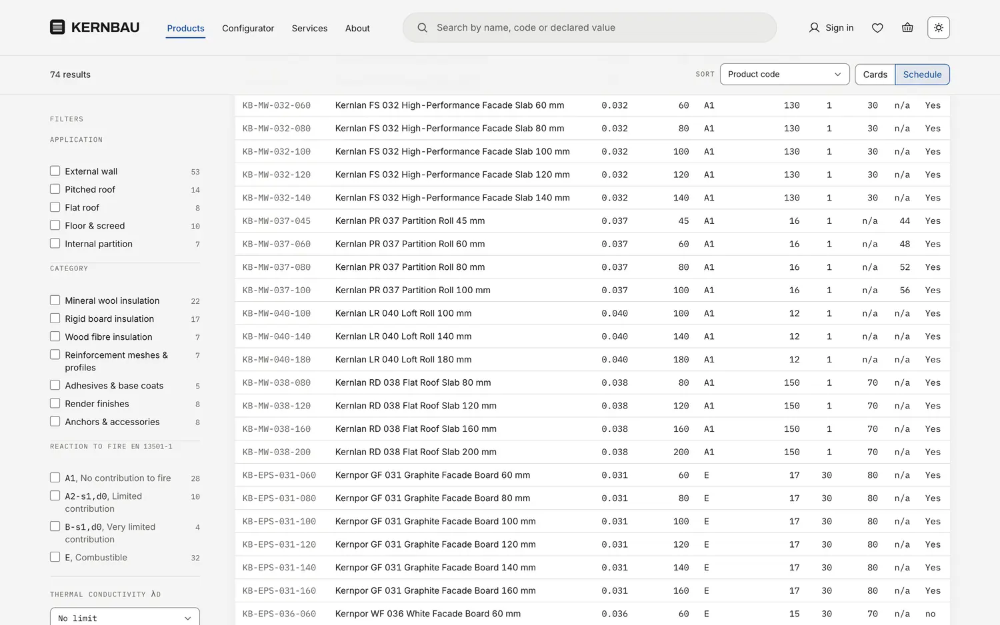

The same query as the grid, read as a specification schedule. Sortable, tabular figures, `aria-sort` on every sortable header.

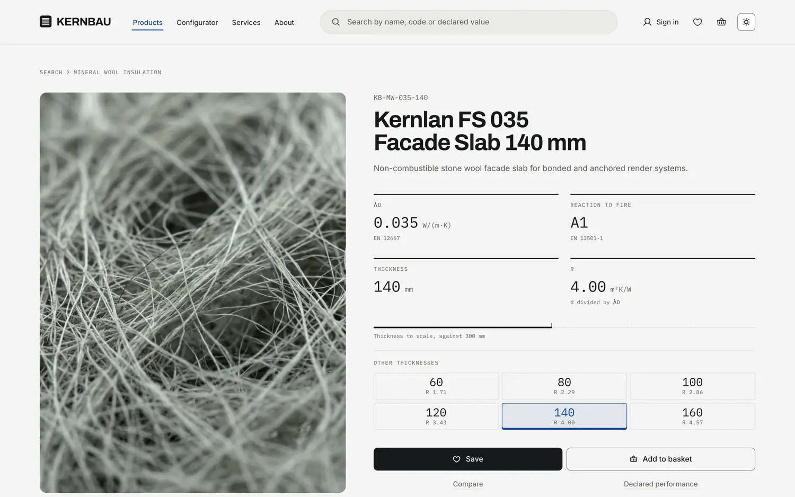

Product detail opens on the values a specifier checks first.

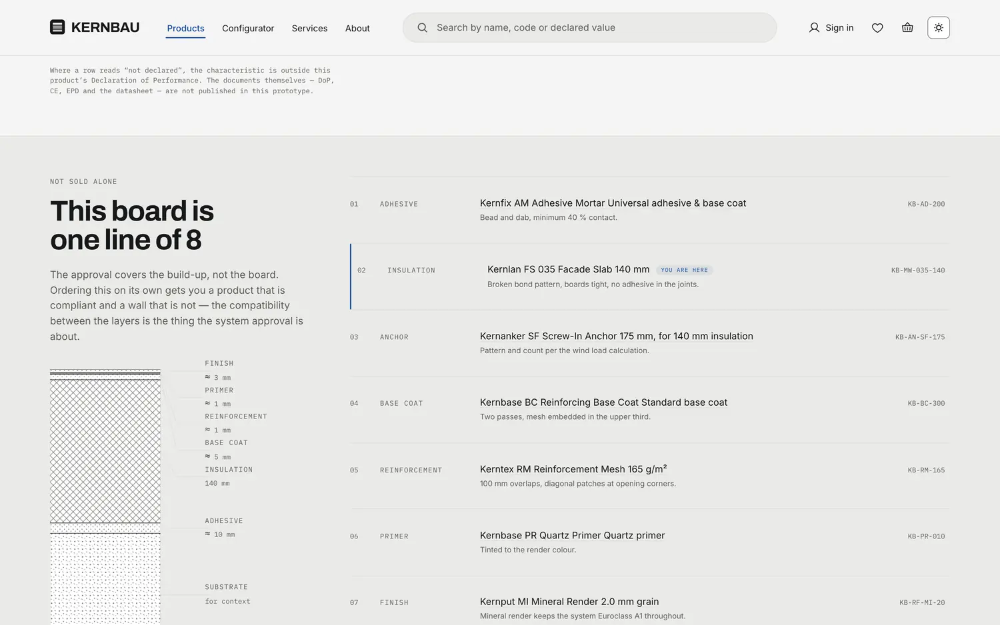

Further down the same page: the system this product belongs to, drawn to scale, with conventional hatch per material and a dimension against every band.

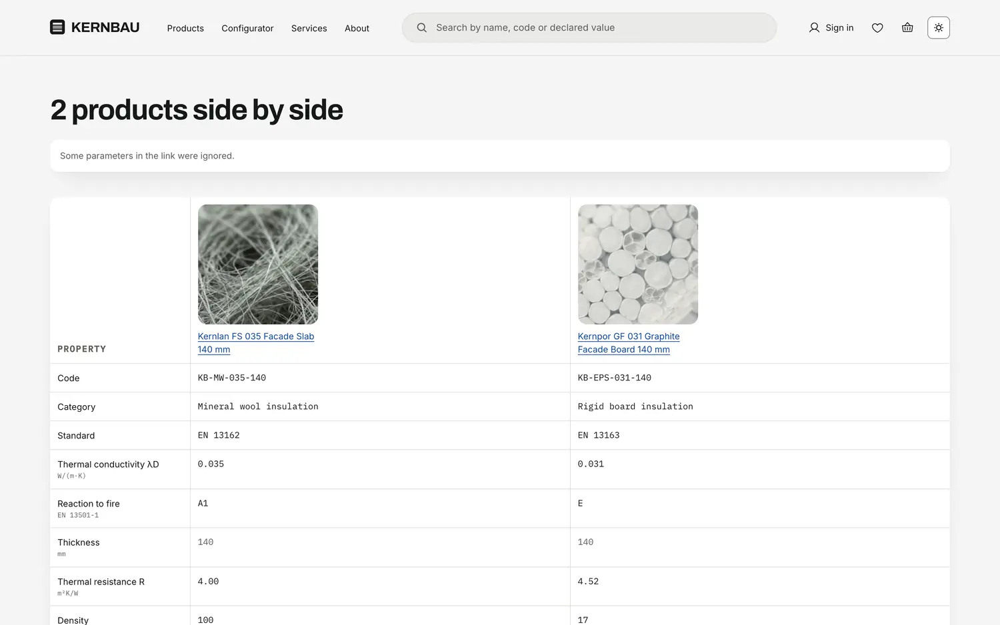

Up to three products compared. Rows that differ are set in full contrast; rows that agree drop back.

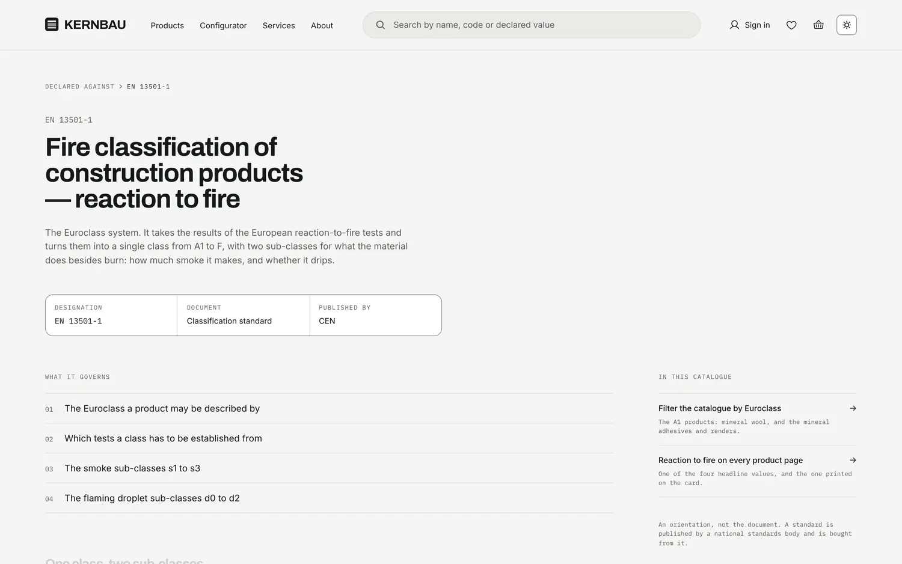

The standards library. The products are invented; these documents are not, so each page says plainly that it is an orientation rather than the standard itself.

### Tools and set pieces


| Feature                        | Where                      | Notes                                                                                                                                                                                                                                                                                                                                                                                        |
| ------------------------------ | -------------------------- | -------------------------------------------------------------------------------------------------------------------------------------------------------------------------------------------------------------------------------------------------------------------------------------------------------------------------------------------------------------------------------------------- |
| **Construction explorer (3D)** | landing page               | Five build-ups as one object, exploded on scroll in installation order, named and measured. CSS 3D transforms — not WebGL, no animation library. One perspective camera that is never unmounted, one `requestAnimationFrame`, springs integrated in the scroll frame, callouts projected in the same frame so a label cannot drift from its layer. Nothing in it re-renders while you scroll |
| **Wall configurator**          | `/configurator`            | Substrate → board → thickness → finish. Pinned section and figures; the schedule scrolls up under them. Roving tabindex with arrow keys on every option group                                                                                                                                                                                                                                |
| Drafting-sheet hero            | landing page               | Inline SVG section with a detail balloon at 4× ; pointing at a band lights its callout and vice versa                                                                                                                                                                                                                                                                                        |
| Build loop                     | landing page               | The wall assembling itself and stepping through three depths, quoting figures from the configurator's own arithmetic. One CSS timeline, no JavaScript                                                                                                                                                                                                                                        |
| Inequality doors               | landing page               | Three specification constraints as pre-filtered links carrying live counts                                                                                                                                                                                                                                                                                                                   |
| Section drawings               | product page, configurator | Drawn to scale, conventional hatch per material, dimension against every band, leader lines where labels cannot sit at true centre                                                                                                                                                                                                                                                           |
| Service sketches               | `/services`                | Five hairline `currentColor` drawings — a specification sheet, a temperature gradient, a plumb line, a certified hour, a cut sample                                                                                                                                                                                                                                                          |
| Schema figure                  | `/about`                   | The six real tables in `db/schema.sql`, drawn in the same hand, with the cardinalities the foreign keys actually declare                                                                                                                                                                                                                                                                     |


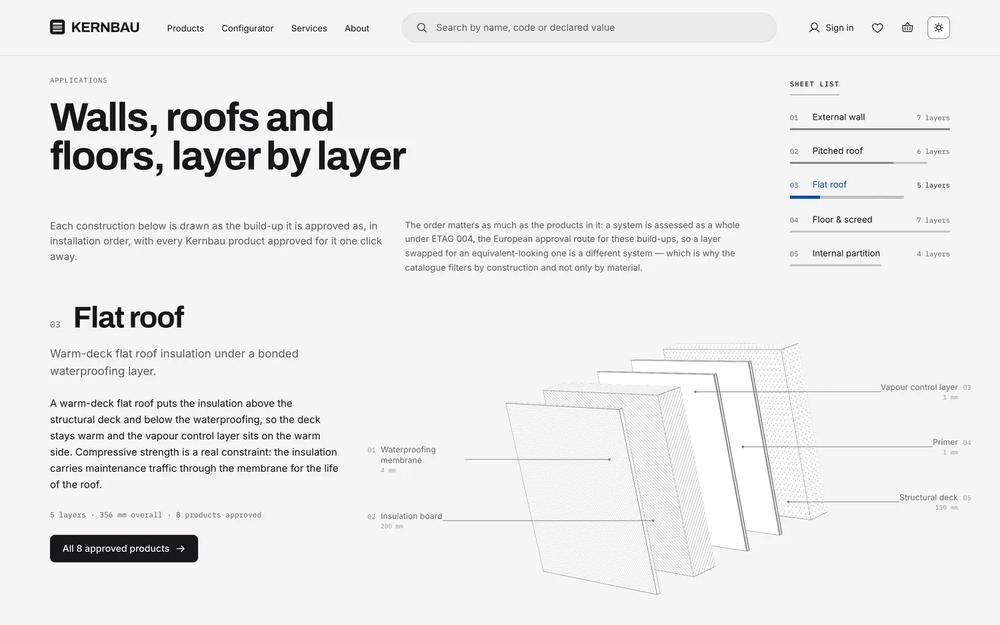

The explorer again, further down the run: a different construction, a different camera, the same object. Nothing is unmounted between the two, which is why there is no cut to feel.

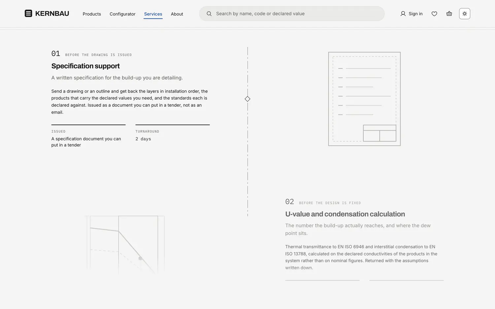

The service sketches. A service is neither a material nor a wall, so it is drawn as the instrument or the artefact it produces.

### Account-shaped surfaces

These exist so the catalogue behaves like a catalogue. What is behind them is
stated plainly rather than faked: a control that is drawn but not built carries
an **in-development stamp** that appears in place on hover, focus or press —
`[components/in-dev.tsx](./components/in-dev.tsx)` — instead of sending you to a
page to be told a button does nothing.


| Feature            | Where         | Notes                                                                                                                                                                                                                                                          |
| ------------------ | ------------- | -------------------------------------------------------------------------------------------------------------------------------------------------------------------------------------------------------------------------------------------------------------- |
| **Favourites**     | `/favourites` | A shortlist kept in `localStorage`. The panel beside it is not a total but a **spread**: best and worst declared conductivity in the list, and whether the fire classes agree — reading five candidates across is the thing a page of cards cannot do          |
| **Basket**         | `/cart`       | A materials schedule, not a shop. The column where a shop puts a line total holds what the quantity **covers**, worked out from the product's own declared format: four boards is not verifiable, 2.4 m² of wall is. Closes on "request a quotation" (stamped) |
| **Sign in**        | `/sign-in`    | Sign in / open an account, with the role split this trade actually has — I specify / I buy. Real labels, real validation affordances, `aria-disabled` submit, and a stamp saying nothing is sent and nothing is stored                                         |
| Live header counts | every page    | The only client component in the header; the shortlist and basket figures move without a navigation, and stay in step across tabs via the `storage` event                                                                                                      |
| Cross-tab sync     | —             | `useSyncExternalStore` over `localStorage`, with a same-tab event of its own                                                                                                                                                                                   |


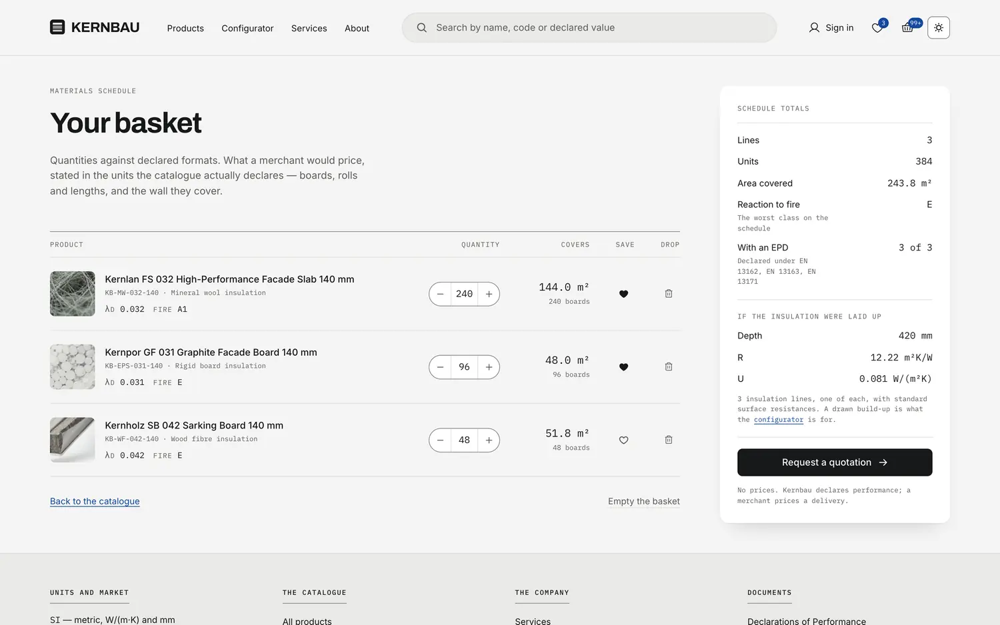

The basket is a materials schedule. Where a shop puts a line total, this puts what the quantity covers, worked out from the product's own declared format — and it closes on a quotation, not a checkout.

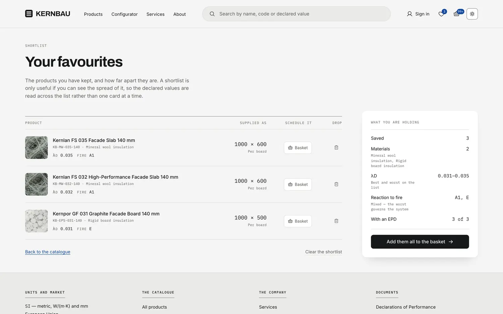

The shortlist. The panel beside it is not a total but a spread: the best and worst declared conductivity in the list, and whether the fire classes agree.

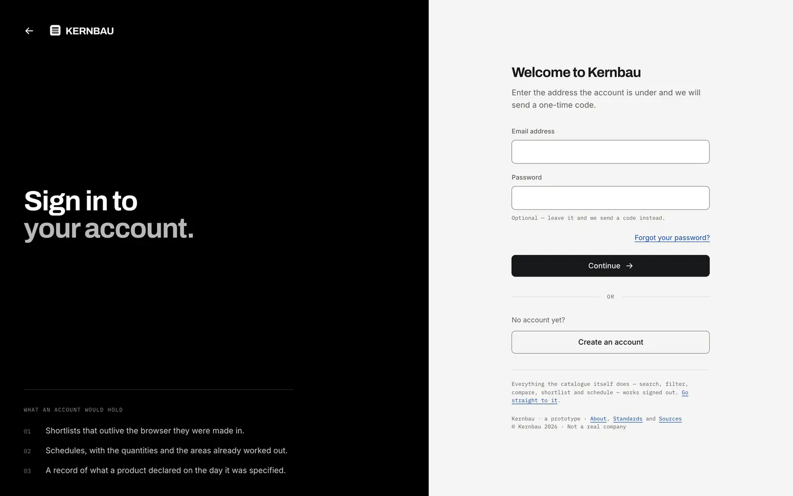

Sign in, with the stamp showing. A control that is drawn but not built says so where it stands, rather than sending you to a page to find out.

### Presentation


| Feature                  | Where                        | Notes                                                                                                                                                                                                                                                                                                                             |
| ------------------------ | ---------------------------- | --------------------------------------------------------------------------------------------------------------------------------------------------------------------------------------------------------------------------------------------------------------------------------------------------------------------------------- |
| **Dark and light theme** | header toggle                | Every colour is a token defined per theme; nothing is an opacity over a ground that flips. Set before first paint by an inline script from `localStorage["kernbau-theme"]`, so there is no flash. Every drawing on the site is inline SVG in `currentColor`, so the whole visual language inverts rather than being shipped twice |
| **Skeleton loaders**     | catalogue, basket, shortlist | The geometry the results will occupy, at the real component's exact card and grid metrics, so nothing reflows when the data lands. Never a spinner. Each skeleton is `aria-hidden`; the wrapper announces "Loading products" **once**, politely, rather than forty empty cards                                                    |
| Title page               | first arrival at `/` only    | The mark, and the figure it is waiting on, printed where a sheet prints its number. Never shown for a pasted product link, a filtered catalogue or a deep link — a front door in the middle of a corridor is a door in the way. Does not run under `prefers-reduced-motion`, and never twice in a session                         |
| Page transitions         | site-wide                    | A veil raised on the click rather than on the arrival, so the order is page → cover → page rather than a flash over the destination                                                                                                                                                                                               |
| Scroll-driven entrances  | site-wide                    | `animation-timeline: view()` — no observer, no hydration cost, and the finished state where it is unsupported                                                                                                                                                                                                                     |


---


## Scope

**In:** product list with server-side search, faceted filters with real counts,
sort and pagination · product detail · construction explorer · wall configurator
· compare · standards library · shortlist and materials schedule · light and dark
theme · all seven required states · responsive · keyboard-operable · WCAG AA ·
Docker.

**Drawn but deliberately not built** — and stamped as such, in place: account
creation and sign-in, password reset, request-a-quotation. Each needs a user
table, a session or a distributor, and none of the three teaches you anything
about discovering a building product. What they do is let the catalogue be
walked through as a catalogue rather than as a demo with holes in it.

**Deliberately out:** prices, stock and checkout (a distributor's concern, and
the reason the basket is a schedule) · multi-language · supplier and admin
panels · real manufacturer data · an automated test suite.

The last one is the significant omission. See [Accessibility](#accessibility)
for what I did instead, and [Limitations](#limitations-and-next-steps) for what
I would add first.

---


## Architecture

The stack itself is in [Technology](#technology). This is how the code is
arranged, and why.

### The seams

Almost all of the logic lives in five files, each with one job.

`lib/db.ts` — one `pg` Pool for the process, with a tagged error type so a
dead database produces a page that says so instead of a stack trace.

`lib/catalogue.ts` — every SQL statement in the application. Worth reading:

- `buildFilters` assembles the dynamic `WHERE` **once**, and the list query, the
facet counts and the empty-state suggestions all reuse it. Every value is a
numbered placeholder; nothing is interpolated. The only fragment that varies
is `ORDER BY`, chosen from a fixed lookup keyed by an already-validated value.
- **Facet counts exclude their own dimension.** Counting categories with the
category filter applied would show every other category at zero, which tells
the user nothing. Excluding it answers the question actually being asked: *if
I also picked this, how many would I get?*
- `COUNT(*) OVER()` takes the pagination total from the same scan as the page.
- Search matches two ways: `ILIKE` for substrings (codes, materials) and
`word_similarity` for typos, at an explicit 0.45 threshold — the pg_trgm
default of 0.6 misses a single dropped letter, and below 0.45 it starts
matching nonsense. A GIN trigram index serves both.
- `suggestRelaxations` runs only when a filter combination returns nothing, and
works out which single change would end it and how many products it returns.

`lib/params.ts` — parses, validates and clamps the query string. The rule:
malformed input degrades to a sensible default *and is reported*, never thrown.
`?page=abc` is not an error condition, it is Tuesday. It is pure and has no
database access, which is why the client can run the identical parse against the
address the instant a box is ticked, a round trip before the answer arrives.

`app/products/actions.ts` **+** `components/catalogue-browser.tsx` — the one
server action the catalogue calls, and the component that calls it. Products,
facet counts and relaxations come back in a single round trip. The client half
is where the interesting cases are, and each has a comment saying why:

- Every request is **numbered**, so an answer that arrives after a newer one was
asked for is dropped rather than painted. Ticking three filters quickly used
to leave whichever query the server happened to finish last.
- A **failed action** leaves the results that are on the screen alone — they are
still true — and adds a line saying the newer set never arrived, with a button
that asks again. `error.tsx` covers the server render and cannot cover this.
- A navigation to `/products` with a **different address** while the component is
already mounted resets it during render rather than in an effect, because the
alternative is one paint of the wrong catalogue.

`lib/build-up.ts` — the arithmetic behind the configurator and the landing
page's worked example. R is `d/λ`, U is the reciprocal of the summed
resistances, surface resistances from EN ISO 6946. Both callers read from here
and neither does arithmetic of its own, so the landing page cannot advertise a
number the tool would not produce.

Two smaller ones carry the interactive drawing: `lib/motion-loop.ts` (a
spring that can be integrated inside the scroll frame, and one shared animation
frame to integrate it in) and `components/stack/geometry.ts` (where every
layer is, in one file, because the slabs draw it and the callouts point at it
and the two may not drift by a pixel).

### Schema

`categories` · `applications` · `products` · `product_applications` ·
`product_components` (the ordered build-up) · `product_documents`.

Every filterable declared characteristic is a **typed, indexed column**, not a
JSON blob — filtering on JSON would have been faster to seed and much slower to
query, and would have thrown away the type checking that makes hand-written SQL
safe. Declared characteristics are nullable, because an anchor genuinely has no
thermal conductivity and a mesh has no compressive strength; `NULL` here means
what *NPD* means on a real declaration.

The schema drops and rebuilds on every start. There is no user-owned data in a
prototype, so a database that is identical on every machine is worth more than
migration machinery.

The figure on `[/about](http://localhost:3000/about)` draws these six tables and
their real cardinalities.

---


## The required states


| State             | How it is handled                                                                                                                                                                                                                                                      | Where to see it                                                                                                                                                 |
| ----------------- | ---------------------------------------------------------------------------------------------------------------------------------------------------------------------------------------------------------------------------------------------------------------------- | --------------------------------------------------------------------------------------------------------------------------------------------------------------- |
| **Empty**         | Names the change that would fix it, with the count it returns — "relax the conductivity limit to λ ≤ 0.035 W/(m·K) — 1 product" — rather than a shrug. The shortlist and the basket each have their own empty state, pointing at the catalogue                         | `[/products?category=mineral-wool&lambda_max=0.032&thickness_min=160](http://localhost:3000/products?category=mineral-wool&lambda_max=0.032&thickness_min=160)` |
| **Loading**       | Skeletons in the exact geometry the results will occupy, so nothing reflows, announced once as a polite line. Never a spinner. A filter change dims the grid it is about to rearrange; "load more" leaves what is on screen untouched and appends skeletons at the end | Throttle the network and change a filter                                                                                                                        |
| **Error**         | Two layers. `app/error.tsx` distinguishes "the database is not reachable" — overwhelmingly the likely cause locally — from a genuine bug and says what to do; the mounted catalogue catches a rejected action itself and keeps the last good results on screen         | `docker compose stop db`, then reload — and then change a filter                                                                                                |
| **Invalid input** | Parsed, clamped and *reported*: unknown values dropped, out-of-range numbers clamped, a reversed thickness range swapped, a Euroclass with a comma in it read whole, and the page says what it did                                                                     | `[/products?page=abc&sort=nonsense&fire=X9&thickness_min=900](http://localhost:3000/products?page=abc&sort=nonsense&fire=X9&thickness_min=900)`                 |
| **Not found**     | Custom 404 for unknown slugs and unmatched URLs, with the product-code pattern and both ways back in                                                                                                                                                                   | `[/products/does-not-exist](http://localhost:3000/products/does-not-exist)`                                                                                     |
| **Screen sizes**  | Mobile-first. The filter rail becomes a sheet worked from the toolbar, the schedule scrolls in its own container, the header wraps, the configurator unpins and stacks                                                                                                 | Resize to 390 px                                                                                                                                                |
| **Accessibility** | See below                                                                                                                                                                                                                                                              |                                                                                                                                                                 |


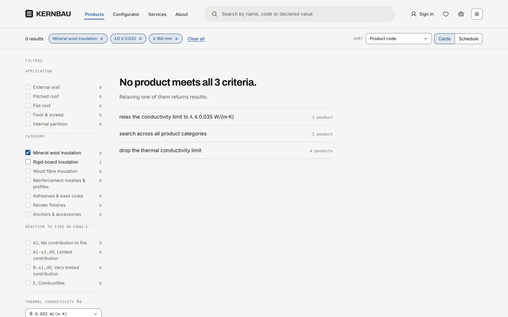

**Empty.** Not a shrug: the one change that would end it, and the count it returns. Worked out by re-running the same filter builder with each constraint dropped in turn.

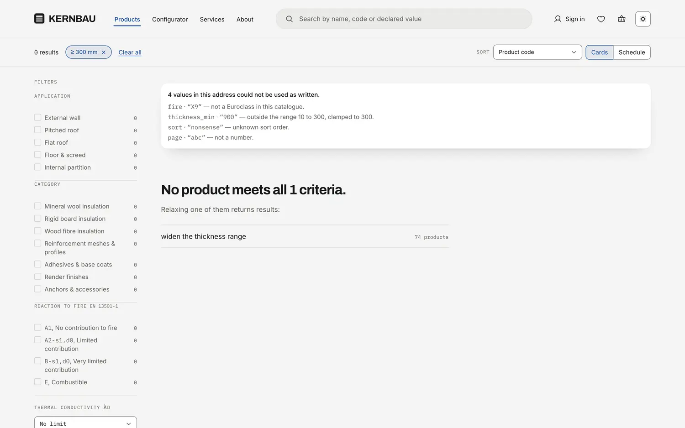

**Invalid input.** `?page=abc&sort=nonsense&fire=X9&thickness_min=900` — every one of those is parsed, clamped or dropped, and the page says which. Nothing throws.


|     |
| --- |
|     |


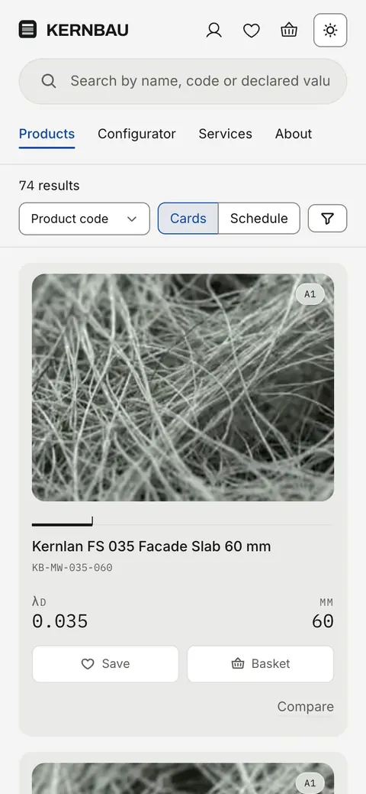


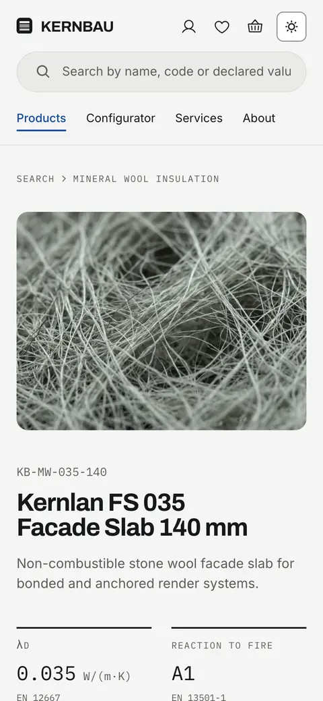


**Screen sizes.** 390 px. The filter rail becomes a sheet worked from the toolbar; the declared values stack rather than scroll sideways.

---


## Data

**Everything in the catalogue is invented.** Kernbau does not exist. No
manufacturer's content was copied.

What is *not* invented is the framework: λD in W/(m·K), reaction to fire as a
Euroclass under EN 13501-1, compressive strength as CS(10\Y) in kPa, vapour
diffusion as a dimensionless μ, a DoP number on every product. The values are
internally consistent — a denser slab has a lower conductivity and a higher
compressive strength, graphite-loaded EPS beats white EPS by roughly the margin
it does in practice, and no product declares a characteristic its product
standard would not require.

**Nothing here is specifiable.** Real declared performance is traceable to a
Declaration of Performance under the Construction Products Regulation, and that
traceability would be a production feature, not a detail. Every page that could
be mistaken for a real datasheet says so; `/about` says it in the trade's own
title block, in the field a drawing uses to state whether it may be built from.

### How it is built

74 products, 7 categories, 5 applications, 205 system layers.

Products are declared as **families with variants** — one slab, six thicknesses,
one datasheet, one DoP series — in `db/generate-catalogue.mjs`, which expands
them into `data/catalogue.json`. That is how a real catalogue works, and it
means no variant can drift from its family. `db/seed.ts` loads the JSON into
Postgres and does not care where it came from: a PIM export against the same
schema would replace it without changing the application.

Two datasets do not live in the database, on purpose. `data/constructions.ts`
holds the five build-ups the explorer draws, because they are geometry and
copy for one component rather than catalogue rows. `lib/standards.ts` holds the
standards library, because those documents are real and are not Kernbau's to
own.

### Sources

Referenced for the shape of the data — naming, units, classification systems. No
text or values were copied from any of them.

- **Regulation (EU) No 305/2011** (Construction Products Regulation) — what CE
marking and a Declaration of Performance mean.
- **EN 13501-1** — reaction to fire classification (Euroclass A1–F, smoke and
droplet sub-classes).
- **EN 13162 / 13163 / 13164 / 13171** — product standards for factory-made
mineral wool, EPS, XPS and wood fibre, and the characteristics each declares.
- **EN 998-1** and **EN 15824** — rendering mortars and organic renders.
- **ETAG 004** — assessment of external thermal insulation composite systems,
and why a system is approved as a whole.
- **EN ISO 6946** — thermal resistance and transmittance, behind the R and U
figures.

The photography in `imgs/json/` was generated for this project.

---


## Design

The brief was a professional building materials company with a consistent visual
language, so the direction comes from the material itself rather than from
software convention: **studio product photography on a near-monochrome ground,
one signal colour, and the declared numbers set as numbers.**

The shape is a catalogue, not a brochure. Landing page, construction explorer,
product grid, product page, compare, configurator: the same sequence a specifier
already knows, so nothing has to be learned before it can be used.

**The card has no frame.** The photograph is the only object on a product card
with a fill; the name, the code and the values sit directly on the page ground.
A grid of these reads as a row of products rather than a row of boxes, and the
photography is what carries the visual weight.

```
┌─────────────────────┐
│                     │   photograph, 14px radius, the only filled object
│                     │
└─────────────────────┘
▔▔▔▔▔▔▔▔▔───────────      thickness, drawn to scale against 300 mm
Kernlan FS 035 Facade Slab 100 mm
KB-MW-035-100
───────────────────────
λD          Fire      mm
0.035       A1       100
```

**The first screen is a sheet.** A photograph of a wall says "marketing". The
same wall in section, at scale, with every layer dimensioned and the skin taken
out into a detail balloon at 4×, says what this catalogue is for: a specifier
does not buy a board, they buy 366 millimetres of wall with a declared U-value
and a fire class. Along the foot, where a sheet carries its title block, the
catalogue states its own extent — and every figure in that block is queried.

**Colour.** An off-white ground (`#F5F5F4` light, `#131414` dark), a muted tone
for secondary text, a hairline rule, a heavier edge for anything operable, and
exactly one accent (`#14489E` / `#7FB0FF`) used *only* where something is
interactive or stateful: links, focus rings, active filters, the current sort.
Because colour appears nowhere else, it reads unambiguously as "you can act
here". That is an accessibility decision as much as an aesthetic one. The whole
page is one theme; no section inverts.

**Both themes are first-class.** Every colour is a token defined per theme —
nothing is an opacity over a ground that flips, which was a real defect found in
the audit and fixed. The choice is written to `localStorage` and applied by an
inline script before first paint, so there is no flash of the wrong theme. Every
drawing on the site is inline SVG in `currentColor` rather than an asset, which
is what lets the whole visual language invert instead of being shipped twice.

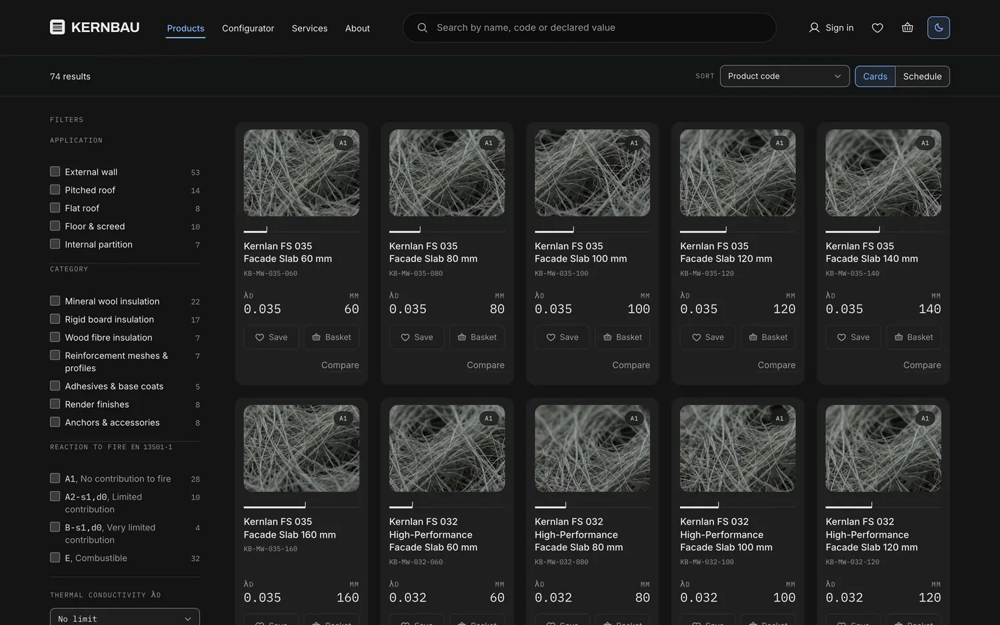

The same catalogue in the dark theme. Only the tokens change — the layout, the photography treatment and the one signal colour are the same object.

**Shape.** One radius system, three steps, applied by role and nothing else:
photography and panels at 14 px, controls at 8 px, removable filter chips as
pills, because a pill reads as something you can take off again.

**Type.** Archivo for display, set heavy and tight. Inter for body and UI. IBM
Plex Mono with tabular figures for **every number, code and standard in the
interface**, so values read as measured rather than as copy, and spec columns
line up digit under digit.

**Products in a family share one photograph**, because they share one datasheet.
Each card crops the shared image differently from a hash of its slug, so a grid
of twelve thicknesses never reads as twelve copies of one picture, and the
drawn thickness scale under each photograph is what actually separates the same
slab at 60 mm and at 160 mm.

**Three visual languages, one system.** Photography identifies *what* a product
is. Drawn hatch shows *anatomy*: sections are drawn to scale, with conventional
hatch per material and a dimension label against every band, so the hatch is
never the only carrier of meaning. And on `/services`, where the subject is
neither a material nor a wall but a thing somebody does, the drawing is of the
instrument or the artefact instead — a specification sheet, a temperature
gradient, a plumb line. An icon set would have been five glyphs; these are five
different objects.

**Motion.** Almost all of it is CSS: entrances run on a scroll-driven timeline
(`animation-timeline: view()`), so there is no observer and no hydration cost,
and a browser without support shows the finished state — which is also exactly
what `prefers-reduced-motion` resolves to. Filters, schedule and compare have no
motion at all: animation on a data table reads as amateur to this audience.

The one exception is the construction explorer, which cannot be CSS: a scroll
position has to become a camera angle and a set of layer transforms in the same
frame it was read in. That is one `requestAnimationFrame` and about ninety lines
of spring in `lib/motion-loop.ts`, not an animation library, and no React render
sits between reading the scroll and painting the result. It resolves to its
static state under `prefers-reduced-motion` like everything else.

> Motion was first built with the Motion library. It was replaced with CSS
> because `whileInView` starts its subject at `opacity: 0`, which means a
> visitor with JavaScript disabled never sees the content at all. Everything
> else on this site works without JavaScript, and an animation is not a good
> reason to break that.

---


## Accessibility

Target: **WCAG 2.1 AA**.

Built in: skip link · landmarks and one `h1` per page · visible focus rings in
the signal colour · the filter panel is a real `<form method="GET">` and every
filter is still a URL, so nothing that narrows the catalogue depends on script ·
`aria-live` result counts · semantic tables with `scope` and `aria-sort` on
sortable headers · roving tabindex with arrow keys on the configurator's option
groups · skeletons hidden from assistive technology with a single polite
announcement above them · meaningful alt text on photography, with decorative
drawings marked `aria-hidden` · hatch never the sole carrier of meaning ·
`prefers-reduced-motion` respected by every sequence, the title page and the
explorer included.

### What the audit found

**axe-core**, driven over the running app in **both themes**:


| Page                   | Light | Dark  |
| ---------------------- | ----- | ----- |
| `/`                    | clean | clean |
| `/products` (chips)    | clean | clean |
| `/products?view=table` | clean | clean |
| `/products/[slug]`     | clean | clean |
| `/compare`             | clean | clean |
| `/about`, 404          | clean | clean |


Four real defects were found this way and fixed:

1. The "at a glance" definition list on the detail page contained a stray `<p>`,
  which is invalid inside a `<dl>`.
2. **The muted text colour failed AA in the light theme** — `#7A7A76` on the
  concrete ground is 3.51:1, not the 4.5:1 it needed. The first audit run
   missed it because the browser was in dark mode, where the same token passes.
   Auditing both themes caught it.
3. When the layout gained alternating **sunken** sections, muted text failed
  again — it had been solved against two of the three grounds, not all three.
   Muted is now `#61615D`, which clears 4.5:1 on every light ground.
4. Secondary text on the inverted bands was set with opacity (`text-surface/70`).
  That cannot work in both themes, because the ink ground flips with the theme
   and the tone has to flip with it. It became a real token defined per theme,
   and the inverted bands themselves were dropped in the redesign that followed,
   so the page now holds one theme end to end.

The second one also exposed a gap in the token system: hairlines and the borders
of things you can operate were the same colour. Control borders now use their
own `--edge` token, clearing the 3:1 that WCAG 1.4.11 requires for user
interface components, while `--rule` stays a hairline for decorative dividers.

Measured contrast, worst case across the grounds each token sits on:


|                      | Light   | Dark    |
| -------------------- | ------- | ------- |
| Primary text         | 14.74:1 | 14.25:1 |
| Muted text           | 5.40:1  | 5.82:1  |
| Signal colour        | 7.11:1  | 7.60:1  |
| Control borders      | 3.20:1  | 4.02:1  |
| Primary button label | 16.29:1 | 15.73:1 |


**Not yet re-audited with axe:** `/configurator`, `/services`, `/standards`,
`/favourites`, `/cart` and `/sign-in`. They are built from the same tokens and
the same components as the pages above and were checked by hand — labels, focus
order, keyboard operation, both themes — but I have not run the tool over them,
and saying they are clean would be a claim rather than a result.

### Manual pass

- [x] Keyboard-only traversal of the full path: home → construction explorer →
  ```
  filtered catalogue → product → compare → configurator. No traps, focus
  visible at every step.
  ```
- [x] Filter state survives refresh, sharing and the back button.
- [x] Shortlist and basket survive a reload, and stay in step across two tabs.
- [x] 200% zoom (tested at a 720 px viewport): no loss of content, no
  ```
  horizontal scrolling; the filter rail collapses to a sheet and the
  schedule scrolls in its own container.
  ```
- [x] `prefers-reduced-motion: reduce` renders every sequence as its static end
  ```
  state rather than playing it faster.
  ```
- [x] Both themes checked at the token level, with the numbers above.

**Honest caveat on JavaScript.** Filters, sort, view switching and pagination
are a plain GET form and ordinary links underneath, and the site search field
posts to the catalogue, so none of the ways in depend on script. But the mounted
catalogue is what makes filtering feel immediate, the construction explorer is a
drawing that needs a frame loop, and the shortlist and basket are browser
storage by definition. With JavaScript off you get a working, server-rendered,
filterable catalogue and every product page; you do not get the explorer, the
live counts or the two lists.

---


## Performance

The eleven source photographs are 7.6 MB. Untouched, that alone fails any
sensible performance target, so `npm run media:optimise` re-encodes them to
**0.7 MB total** and normalises their tone — the macros drift green and one runs
warm, and a shared desaturation pulls them into one range more cheaply than
reshooting. `next/image` then derives AVIF and WebP at the widths each layout
actually asks for, with explicit `sizes` on every image and long cache lifetimes
because the sources never change.

The client bundle carries **no animation library and no state library**. Every
drawing on the site is inline SVG, every entrance is a CSS animation, the two
lists are `useSyncExternalStore` over `localStorage`, and the one frame loop is
ninety lines.

The explorer is the heaviest thing here and is built not to be: everything is
drawn once on mount and never re-rendered, the scroll is read in one animation
frame per painted frame and turned into transforms written straight onto nodes,
and which layer is hovered is a ref — an opacity is not worth a render.

Pages that read the database render per request; only `/about`, `/services`, the
standards pages and the 404 are static. That is deliberate: the database does
not exist during `docker build`, and a catalogue whose stock of products changes
should not be baked into a bundle.

---


## Limitations and next steps

**Known limitations**

- Every declared value is invented. Nothing here is specifiable.
- Sign-in, account creation, password reset and request-a-quotation are drawn
and stamped, not built. Nothing is sent and nothing is stored.
- The shortlist and the basket live in `localStorage`, so they belong to a
browser rather than to a person, and clearing site data clears them.
- One market, one language. The schema keeps text separable so translation is an
addition rather than a rewrite, but nothing is translated.
- Documents are stubs — a real catalogue links the actual DoP, EPD and datasheet
PDFs, and that link is the whole point of the DoP.
- The U-value figures are indicative. A specification figure comes from a full
EN ISO 6946 calculation including fixings, air gaps and thermal bridging, and
every interface that quotes one says so.
- Typo tolerance is per-word: "kernpore" and "wol" match, "mienral wol" does not.
- An unknown product slug renders the 404 page but answers **200**, not 404. The
catalogue segment has a `loading.tsx`, so the shell is streamed — and the
status is committed — before `notFound()` is reached. Moving that loading
state into a Suspense boundary below the fetch would fix it; the trade was
taken knowingly and it is the first thing on the list below.
- Two photographs do double duty as both a construction header and a material
texture. Alt text describes what is actually in each image.

**What I would do next, in order**

1. **The 404 status code**, which is a ten-minute fix and a real one.
2. **Tests.** Playwright for the happy path and the URL-state contract; unit
  tests for `lib/params.ts`, which is pure, is where the Euroclass-comma and
   reversed-range logic lives, and is exactly where an off-by-one would hide.
3. **axe over the six pages listed above**, to close the gap in the audit table.
4. **Real DoP traceability** — link every declared value to the document that
  backs it, which is the feature that would make this trustworthy.
5. **A saved specification** — an account, and the shortlist promoted from
  browser storage to something a person owns and can send to a colleague.
6. **i18n**, using the separable text fields already in the schema.
7. **Query-level caching** of facet counts, which are the most repeated queries.

---


## Repository map

```
app/
  page.tsx               landing — sheet hero, ways in, construction explorer,
                         inequality doors, configurator trial
  products/              catalogue, product detail, the browse server action
  compare/               up to three products side by side
  configurator/          the wall configurator
  standards/             the six documents the catalogue declares against
  services/  about/      what the company does; what this prototype is
  favourites/  cart/     shortlist and materials schedule
  sign-in/               drawn, stamped, not built
  error.tsx  not-found.tsx  robots.ts  sitemap.ts
components/
  catalogue-browser.tsx  the mounted catalogue: filters, sort, view, paging
  filters.tsx  spec-schedule.tsx  product-card.tsx  compare-button.tsx
  site-search.tsx        the search panel in the header
  stack/                 the construction explorer — camera, slabs, callouts,
                         geometry, timeline, hatch sprites
  wall-configurator.tsx  wall-section.tsx  u-value.tsx
  drafting-sheet.tsx  build-loop.tsx  section-drawing.tsx  hatch-defs.tsx
  service-sketch.tsx  schema-figure.tsx
  skeletons.tsx          loading geometry for every list on the site
  cart-view.tsx  favourites-view.tsx  schedule-row.tsx  account-bar.tsx
  sign-in.tsx  in-dev.tsx    the not-built stamp
  site-header.tsx  site-footer.tsx  site-loader.tsx  theme-toggle.tsx
lib/
  db.ts                  pg Pool, tagged connection error
  catalogue.ts           every SQL query in the application
  params.ts              URL parsing, validation, clamping
  build-up.ts            R and U arithmetic, shared by the configurator and
                         the landing page
  store.ts               shortlist and basket, over localStorage
  motion-loop.ts         spring and shared animation frame
  standards.ts           the standards library
  media.ts               texture ↔ photograph mapping and alt text
  format.ts  schedule.ts value formatting, R-value, quantities and coverage
db/
  schema.sql             tables, constraints, indexes
  seed.ts                loads data/catalogue.json into Postgres
  generate-catalogue.mjs authors the fictional catalogue
data/
  catalogue.json         the seed data — the swappable part
  constructions.ts       the five build-ups the explorer draws
docs/screenshots/        the reference renderings used in this README
scripts/                 image optimisation
docker-compose.yml       app + db, one command
notes.md                 the reasoning log written during the work
```

